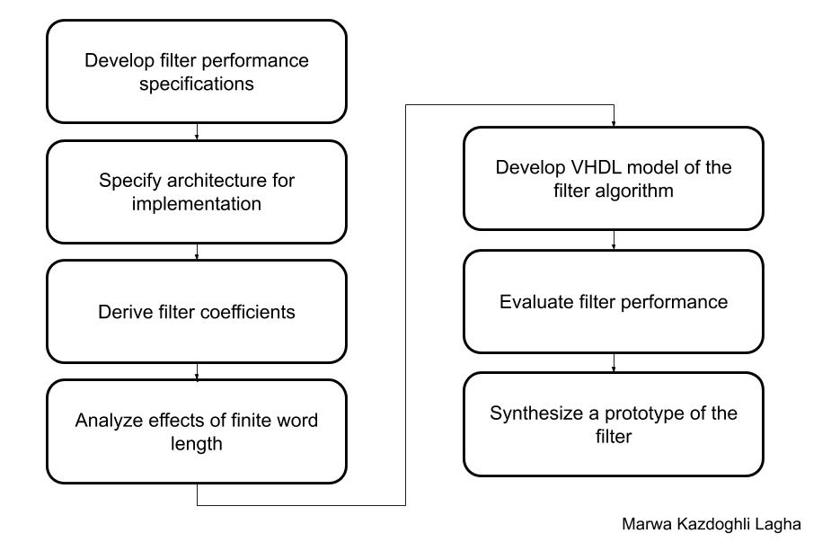
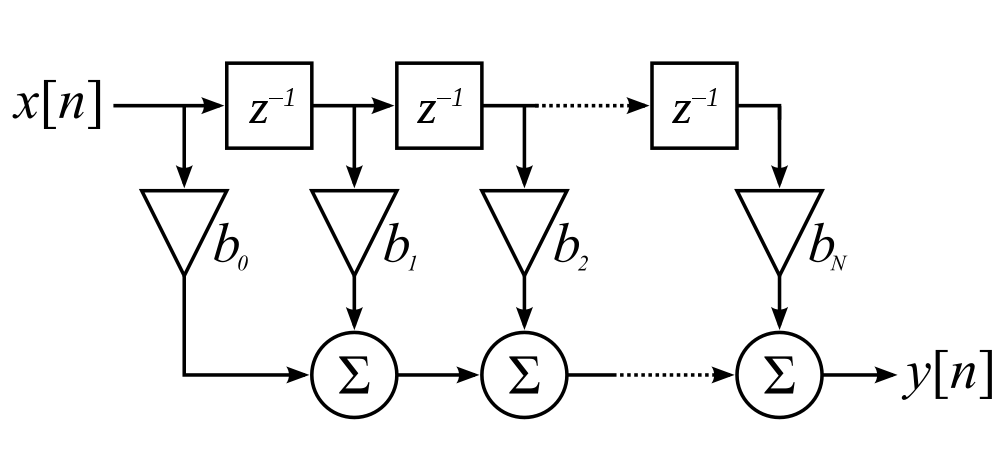
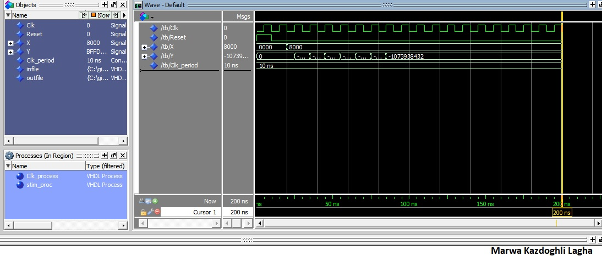
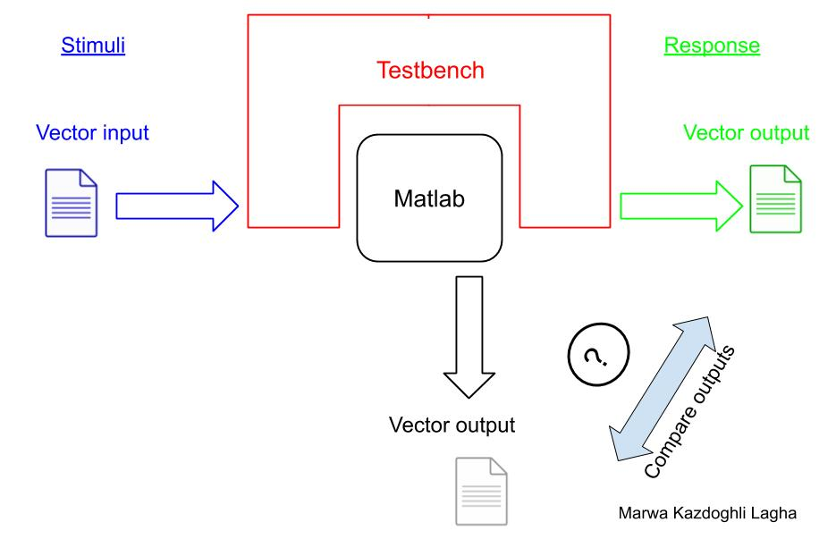
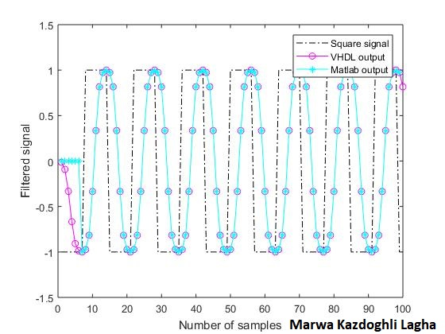
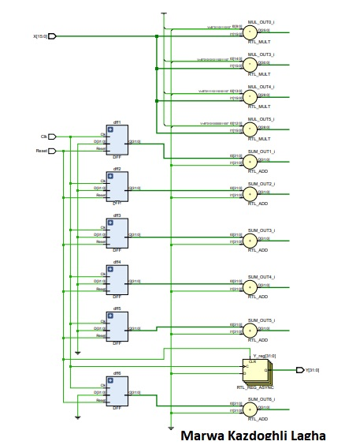
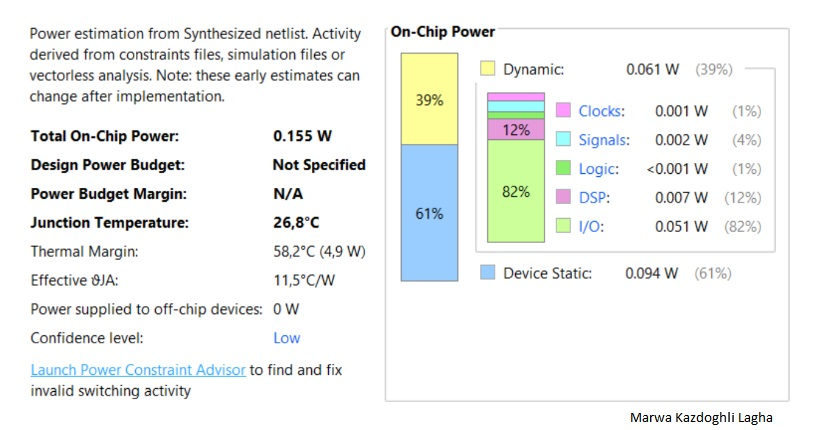
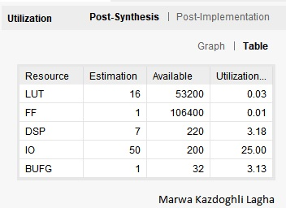
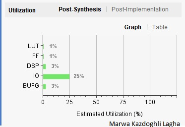

# VHDL implementation of an FIR filter

The aim of this project is to design a digital circuit that creates a low pass finite impulsive response (FIR) filter of order N (N = 6).
The normalized cut-off frequency .  with (https://latex.codecogs.com/gif.latex?%5Cinline%20f_c) is the sampling frequency.
The filter expression is given by

For implementation purpose, inputs, outputs and coefficients use a 16 bits representation. 
For the coefficients, the following values can be used (https://latex.codecogs.com/gif.latex?%5Cinline%20%7B%20b_0%20%3D%200.0135%3B%20b_1%20%3D%200.0785%3B%20b_2%20%3D%200.2409%3B%20b_3%20%3D%200.3344%3B%20b_4%20%3D%200.2409%3B%20b_5%20%3D%200.0785%3B%20b_6%20%3D%200.0135%3B%20%7D)

The final project report contains: 
* General introduction 
* Project steps
* Conclusions
 
 ## General introduction
 
In signal processing, a finite impulse response (FIR) filter is a filter whose impulse response (or response to any finite length input) is of finite duration, because it settles to zero in finite time. 
This is in contrast to infinite impulse response (IIR) filters, which may have internal feedback and may continue to respond indefinitely (usually decaying).
The impulse response (that is the output in response to a Kronecker delta input) of an Nth-order discrete-time FIR filter lasts exactly N + 1 samples (from first nonzero element through last nonzero element) before it then settles to zero.
FIR filters can be discrete-time or continuous-time, and digital or analog.

:bulb: Definition

For a causal discrete-time FIR filter of order N, each value of the output sequence is a weighted sum of the most recent input values as

where x[n] is the input signal, y[n] is the output signal, N is the filter order; an Nth-order filter has N+1 terms on the right-hand side and (https://latex.codecogs.com/gif.latex?%5Cinline%20b_i)  is the value of the impulse response at the i'th instant of an Nth-order FIR filter. 
If the filter is a direct form FIR filter then  (https://latex.codecogs.com/gif.latex?%5Cinline%20b_i)  is also a coefficient of the filter.
This computation is also known as discrete convolution.

:bulb: Proprieties

An FIR filter has a number of useful properties which sometimes make it preferable to an infinite impulse response (IIR) filter. 
FIR filters:

* Require no feedback. This means that any rounding errors are not compounded by summed iterations. The same relative error occurs in each calculation. This also makes implementation simpler.
* Are inherently stable, since the output is a sum of a finite number of finite multiples of the input values, so can be no greater than (https://latex.codecogs.com/gif.latex?%5Cinline%20%5Csum%20%7Cb_i%7C) times the largest value appearing in the input.
* Can easily be designed to be linear phase by making the coefficient sequence symmetric. This property is sometimes desired for phase-sensitive applications, for example data communications, seismology, crossover filters, and mastering.

:bulb: Filter design

When a particular frequency response is desired, several different design methods are common

* Window design method
* Frequency Sampling method
* Least MSE (mean square error) method
* Parks-McClellan method. 
* Equiripple FIR filters can be designed using the FFT algorithms as well.

 ## Project steps
 
 The project steps are detailed in the below design flow
 
 
 
 
 The proposed technical levels are:

1. Specify architecture for implementation
2. Derive filter coefficient
3. Analyse effects of finite word length
4. Main component of implementation circuit
5. Evaluate filter performance
6. Synthesis and hardware implementation of the project

### 1. Specify architecture for implementation

Different architecture designs were adopted for the FIR filters and in this project, the chosen design is the transported form depicted bellow.

The reason to choose this king of filter is thanks to 
*Simplicity of the design
*Shortest path registry-logic-registry permiting the reduce of the timing in the critical path increasing the clock frequency reacheble with FPGA implementation.

The small drawback is that this solution brings a higher latency for the input data that will traverse the entire registry chain.  
But, in stable regime, it will output new data per each clock cycle.

### 2.  Derive filter coefficient

To perform double to integer conversion, we need first to define some parameters

~~~~
1. Bits

We need to specify the number of bits, B, needed to represent the integer output. 
The number of levels at which the block quantizes the floating-point input is 2^B.

2. Peak 

The peak orthe largest input amplitude to be encoded is denoted by V. 
Real or imaginary input values greater than (1-2^(1-B))V or less than -V saturate (independently for complex inputs) at those limits.

3. Output type

We need to specify the data type of the block's output, Unsigned integer or Signed integer.
~~~~

The quantized floating-point value is uniquely mapped (encoded) to one of 2^B integer values.
When the Output type is set to Unsigned integer, the smallest quantized floating-point value, -V, is mapped to the integer 0, and the largest quantized floating-point value, (https://latex.codecogs.com/gif.latex?%5Cinline%20%281-2%5E%7B%281-B%29%7D%29V), is mapped to the integer (https://latex.codecogs.com/gif.latex?%5Cinline%202%5EB-1).
Intermediate quantized floating-point values are linearly (uniformly) mapped to the intermediate integers in the range (https://latex.codecogs.com/gif.latex?%5Cinline%20%5B0%2C%202%5E%7B%28B-1%29%7D%5D). 

Through numerical calculations via Matlab, the coefficients are converted to integer representation and have the values: 
(https://latex.codecogs.com/gif.latex?%5Cinline%20%7Bb_0%20%3D%20442%3B%20b_1%20%3D%202572%3B%20b_2%20%3D%207894%3B%20b_3%20%3D%2010958%3B%20b_4%20%3D%207894%3B%20b_5%20%3D%202572%3B%20b_6%20%3D442%7D).

Note that the output size of the filter process is of 32 bits.

### 3.  Analyze the effects of finite word length

To stress out the size limits, the filter was fed with the maximum value (-32768) in modulus repeated continously and checked if the output 
corresponded to the value given by applying the filtering process in Matlab.
As depicted in the figure bellow, the network at regime settles to -1073938432 that corresponds to the value returned by Matlab.

 

### 4.  Main component of implementation circuit

The component of the proposed filter design structure is composed by

1. Register
Prepared for storage of past position data of brunches. 

2. Adder
Adder is made to reduce the number of stages and is a key for stable operation of the FPGA used in the board. 
This reduction of the stage is effective to avoid errors by clock skew in the FPGA and to reduce the power consumption and a circuit area (or number of gates) on FPGA.

3. Multiplier 
Build-in multipliers are used to fulfill the requirements of high-speed operation. Therefore, the number of the build-in multipliers are one of the constraints to the number of taps of FIR filter.

4. Shift Register
It is used for additional delay for adjust latency to one or two revolution period.

A test-bench was used to read the input values and write the subsequent filtering result. 
The VHDL ouput is then compared with results obtained with Matlab.

### 5. Evaluate filter performance

A test-bench file was writen to evaluate filtering process with an exchange between the inputs and outputs data from/to file. 
Subsequent comparaisons will be performed with the output of Matlab performing the same operation.

 

To test the effectivness of the code, a square wave was introduced to the network. 
The resulted filtering ouput converges in a sine wave, which perfectly corresponds to the Matlab filtering process.

 
 
### 6. Synthesis and hardware implementation of the project

The hardware implementation of the design was carried out using Vivado software by Xilinx. The targed will be the Zynq-7000 borad.
The typical flow of hardware implementation implies 

1. RTL analysis
2. Synthesis and finally the implementation

1. RTL view

Figure bellow shows the RTL view of the FIR filter.
 

2. Synthesis
	
	2.1- Timing report
		For a clock period set to 10 ns, we derive an appropriate timing report. 

	2.2- Maximum operating frequency
		A non zero value of positive worst negative slack is show in the timing report. This implies a circuit not operating at the maximum frequency possible
		(https://latex.codecogs.com/gif.latex?%5Cinline%20%7Bf_%7Bmax%7D%20%3D%20%5Cfrac%7B1%7D%7Bt_%7Bclk%7D-slack%7D%20%3D%20%5Cfrac%7B1%7D%7B10ns-6.18ns%7D%20%3D%20%5Cfrac%7B1%7D%7B3.82ns%7D%20%3D%20260MHz%7D)
		Thus, the maximum frequency at which the clock can be guided is 260 MHz.

	2.3- Power report
		The on-chip power are basically from the I/O peripherials (82%) and in a second part from the DSP used for multiplications and additions (12%).
		

	2.4- Utilization report
		The used resource us the I/O as the circuit has 16 bits input and a 32 bits output.
 		
 		
 
## Conclusions

The proposed project meets the filtering process requirements.
Further improvements can be made by:
	1- Reducing the number of multiplications for symmetricfilter.
	2- Improving filter precision by exploitung the floating point numbers or increasing the number of steps.

